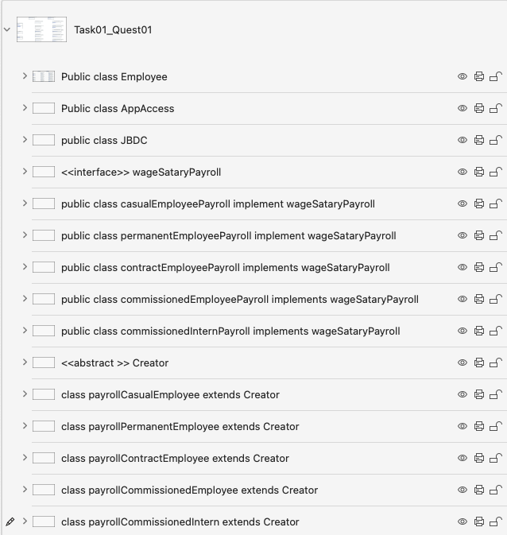

## QUESTION02

In this  analysis of the requirements:

1. There is a “template” class types, which are best represented as either abstract classes or <<interfaces>>, WageSataryPayroll.

2. However there are variations of these “template” clases based on the type of employee:
- [x] Administrator
- [x] Permanent Employee
- [x] Contract Employee
- [x] Commission Sales Employee
- [x] Commissioned Intern
3. The JBDC Class is merely a connection class to the underlying database system…
   It is the view of the this developer that the implementation of this requirement is best done with either a Factory Design Pattern, or an Abstract Factory Design Pattern.

Yet to simplify this design, By only creating An interface class with WageSataryPayroll, That by using a factory class Will create the different classes that calculate the different payrolls. Create Employee, AppAccess, JDBC as normal classes. This is because the differentiation between classes is really by the methods that are part of the classes, and so because there is a need to calculate different wages, payroll depending upon the role of the employee, it is better to create an interface class that then can be extended, and then implemented with the process details relevant to the role of the employee.

It is the view of this author that the implementation of this design is best elaborated by either a Factory or Abstract Factory patterns
One of the main differences between Factory and Abstract Factory patterns is the level of abstraction. The Factory pattern deals with creating objects of a single type, while the Abstract Factory pattern deals with creating objects of related types.
The Factory pattern is simpler and more flexible, but the Abstract Factory pattern is more robust and consistent. Another difference is the number of classes involved. The Factory pattern usually has one Factory class and one interface for the products, while the Abstract Factory pattern has one Abstract Factory interface, multiple concrete Factory classes, and multiple interfaces for the products. The Factory pattern is easier to implement and maintain, but the Abstract Factory pattern is more scalable and extensible.

This has the following outline of component classes...

For simplicity sake, this author has chosen to implement this using the factory design pattern.

Refer to "ANSWERS-TASK1-QUEST01.md"

  