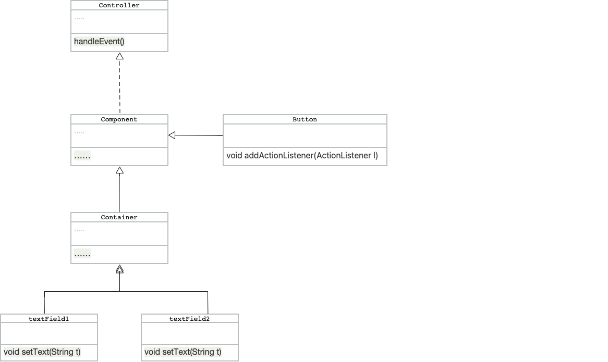

## QUESTION04

Consider an application that has a form that adds two numbers  in two textFields as , and a Button that adds the two numbers, and prints the result separately. This has a hierarchy of handlers that handle the user Interface events that consist of the entry of the Numbers into the relevant text field, and the clicking of the button, that represents a request to initiate the calculation of the addition of the numbers. Because of the chain of responsibility, in handling the request to calculate the numbers entered, this request is best handled by a chain of responsibility design pattern. This is a behavioral design pattern that allows you to pass up the request through the hierarchy  of request handlers to that handler that is able to respond and process the request.

In our case the card view would represent the graphical user interface view of element such as a button, checkbox, or text field. Associated with that card view, would be a card controller that contains a listener for events such as clicking on a button, or the entry of Numbers into a text field. The assembly of all the different card viewed elements would be managed by  layout view, and an associated layout controller, that would receive the event request from the card controller and process the request by taking the Numbers from the text fields. adding them, and printing them. And so the chain of responsibility would be CardView() --> CardController()  --> LayoutView()-->LayoutController.

  