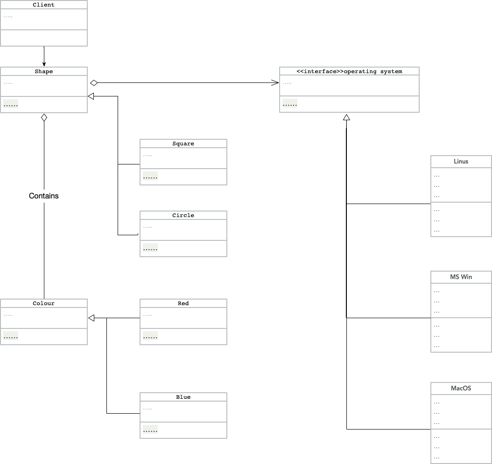

## QUESTION05

In developing a cross platform application That would beDesigned to operate on different operating systems such as MS Windows, Linux, and Apple MacOS, or Android, such as a graphical user interface toolkit, such as the The java Swing Classes, or the open source widget toolkit “Tk” that providea library of basic graphical user interface elements.
The approach with this is to separate the view elements that comprised the graphical user interface component from the underlying implementation that would make calls to the relevant application programme interfaces that belong to the underlying operating system.

The choice in the design pattern that is appropriate to this Development requirement Is between the bridge design pattern and the adapter design pattern. Both Of these are Structural Design Patterns.

The Adapter Design pattern Is a structural design pattern that allows objects with incompatible Interfaces to be able to collaborate with each other. It uses a special object that will convert the interface of one object So that. An object of a different type can understand it. You can use the adapter class when you want to use some existing classes But the interface is not compatible with your Application code.  Using the Adapter design pattern Will let you create a middle layer class That will serve as a translator between your application code And the legacy class, Which may be a third party class,  or any other Class with a rather strange application interface.

The bridge design pattern is a structural design pattern that lets you split a large class into a set of closely classes into two separate hierarchies: one for abstraction and another for implementation, which can be developed independently of each other. When talking about Real applications, the abstraction can be represented by a graphical user interface, and the implementation could be the underlying System code (API) which the graphical user interface layer calls in response to the user interaction.

From this, Generally Choose the Adapter Design pattern When you have an existing application that has to Interact with existing Incompatible legacy classes. Yet Choose the Bridge design. Structural pattern., When you are designing an application up front, But you need to develop parts of your application independently of each other..

For this particular requirement, The bridge design pattern Would be the most appropriate design pattern, As you would be able to develop. a generic Set of graphical user interface objects, That would be abstracted From the underlying implementation details That would be making the calls to the relevant Underlying Operating system Application programming interfaces. For example, If there is a facility to change the colour of a User interface element contained in the client But then makes a call to the relevant abstraction feature, it is through the. Implementation interface to the Concrete implementation That the call is made To the operating system application programme interface method that would change the colour..

  