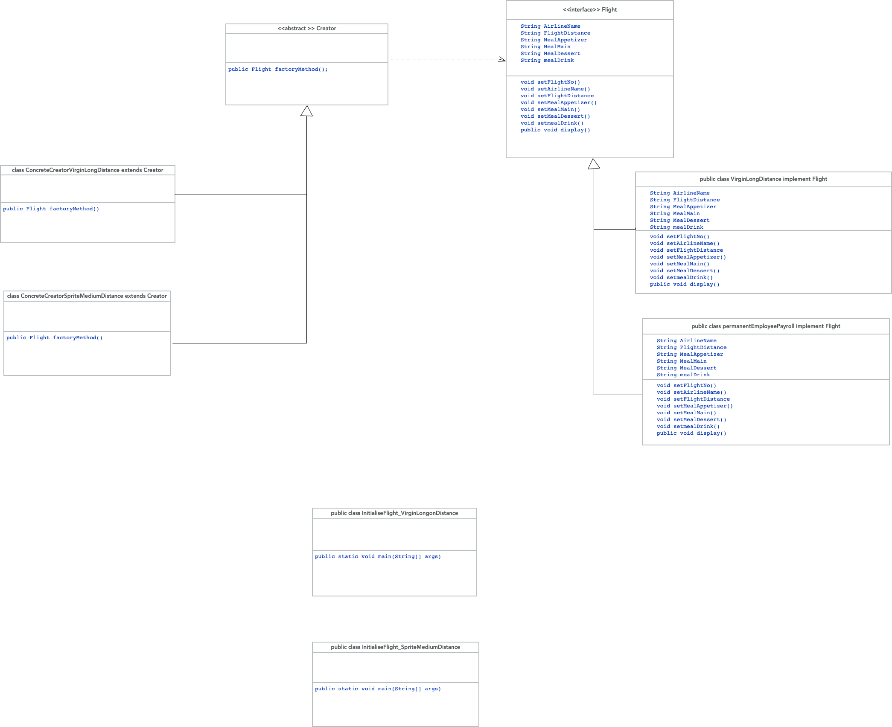

## QUESTION07

The factory method design pattern Defines an interface for creating an object, But let's the subclass determine which class to instantiate, and so the factory method lets a class defer instantiation to a subclass… and so here we have flights, and separately meals, and separately airlines as interface  or abstract classes that can be instantiated. 
The product we are defining here is the flight, as it is composed of an airline, the distance of the flight, and the meal selection. Here the distance of fight is a string attribute of the flight abstract/Interface class, and airline and meal are abstract/interfaces classes. Because java allows multiple inheritance by using interfaces, then the product, flight would be
as given in the elaborated codein  "ANSWERS-TASK03-QUEST07"

  